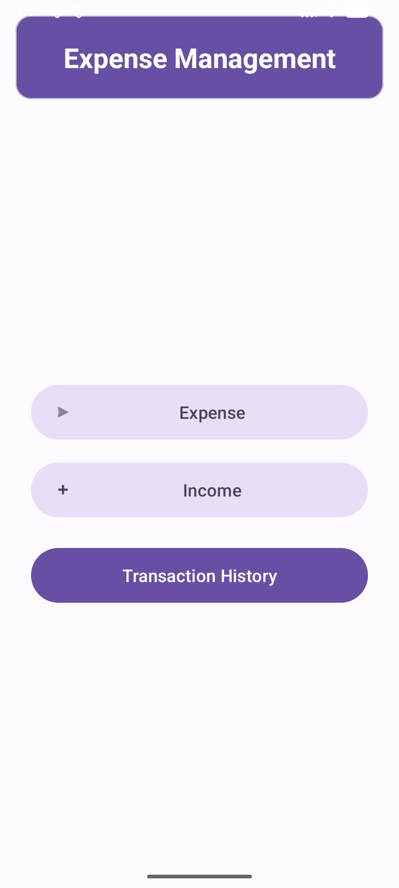
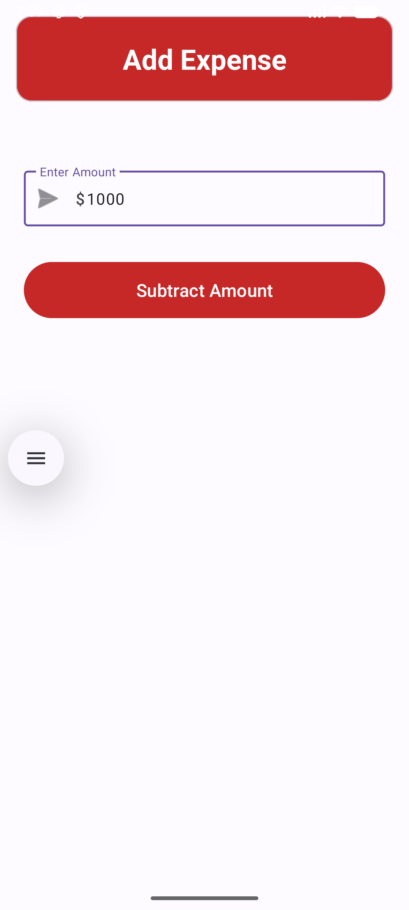
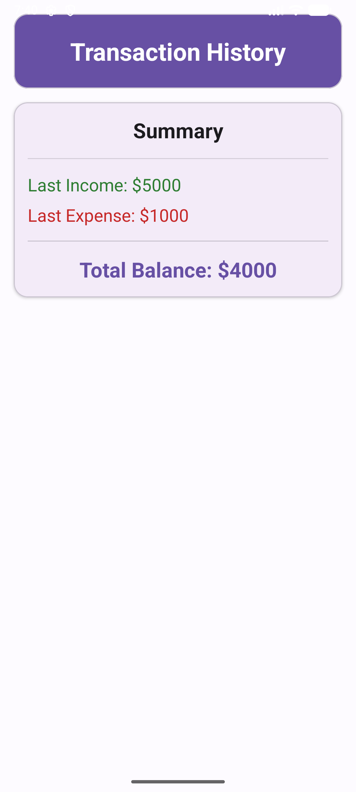

# 💰 Expense Management Android App

---

## 📌 Project Overview

The **Expense Management Android App** is a mobile application designed to help users manage their daily financial activities efficiently. It allows users to add and subtract expenses, providing a simple and intuitive interface for tracking spending.

This project focuses on delivering a clean UI, real-time updates, and ease of use for better financial awareness.

---

## 🎯 Objectives

- To develop a user-friendly mobile application for expense tracking  
- To simplify daily financial management  
- To provide real-time calculation of expenses  
- To improve financial discipline among users  

---

## ✨ Key Features

- ➕ Add Expense functionality  
- ➖ Subtract Expense functionality  
- 📊 Real-time calculation  
- 📱 Clean and simple UI  
- ⚡ Lightweight and fast performance  
- 🔄 Instant updates on user interaction  

---

## 🛠️ Technology Stack

| Category        | Technology Used        |
|----------------|----------------------|
| Language       | Java / Kotlin         |
| IDE            | Android Studio        |
| Build Tool     | Gradle                |
| UI Design      | XML Layouts           |
| Platform       | Android               |

---

## 📸 Screenshots

### 🏠 Home Screen

### ➕ Add Expense

### ➖ Expense Result

---

## ⚙️ Working Principle

- User enters an amount  
- Application processes the input  
- Based on button action:
  - Add → increases total  
  - Subtract → decreases total  
- Result is displayed instantly  

---

## 🔮 Future Enhancements

- 📊 Graphs and analytics dashboard  
- ☁️ Firebase integration  
- 🔐 User authentication system  
- 💾 Database storage (SQLite)  
- 📱 Multi-device sync  
- 🌙 Dark mode  

---

## 👨‍💻 Author

**Raj Savaliya**  
B.Tech IT Student  

---

## 📜 License

This project is for educational purposes only.

---

## ⭐ Support

If you found this project helpful:

👉 Give it a ⭐ on GitHub  
👉 Share with others  

---

## 🙌 Acknowledgement

- Android Studio Documentation  
- Open-source community  
- Academic guidance  

---

✨ *“Good financial management starts with tracking your expenses.”*
